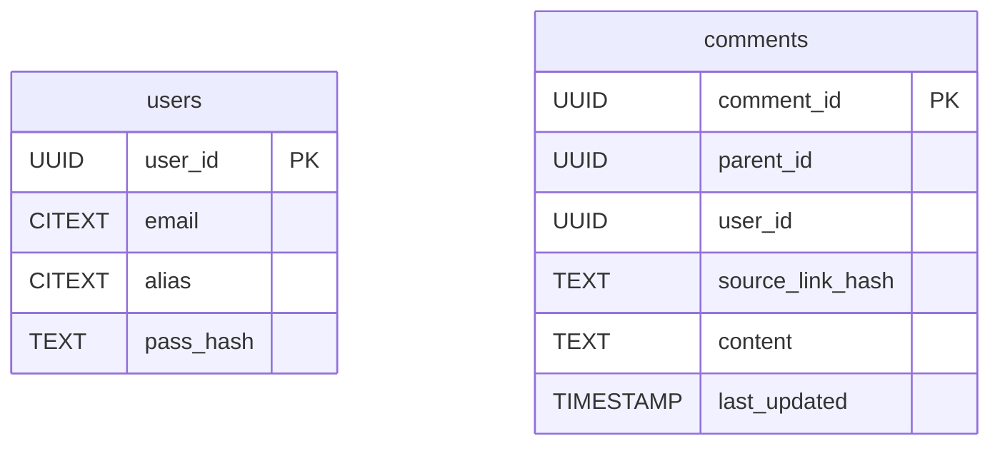
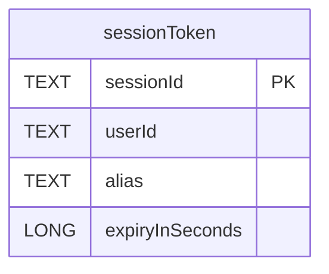
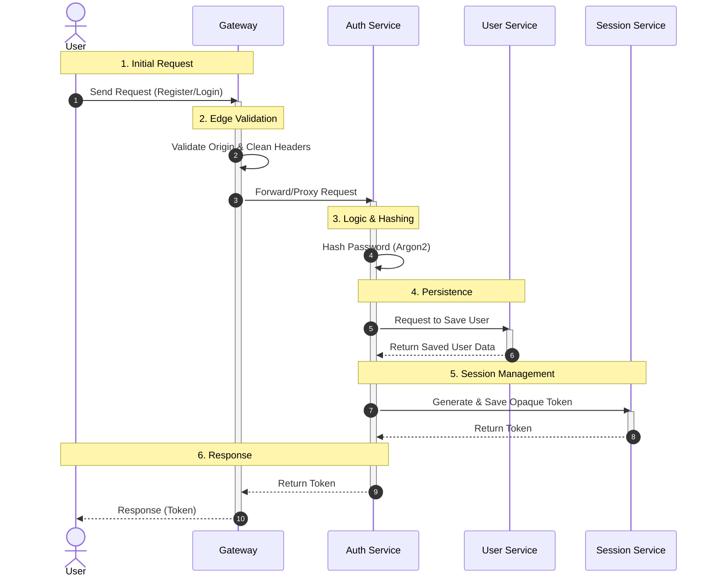
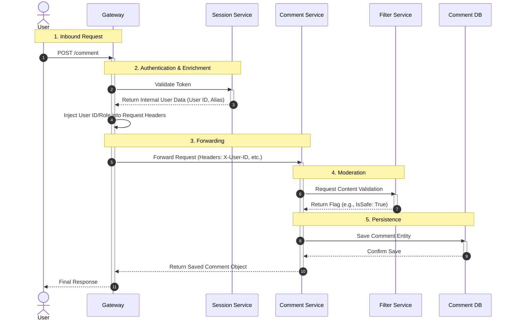

# Architecture
System level overview of the most important logic chains
## Chapters:
1. [Necesary Db Data](#necessary-db-data)
2. [Authentication Flow](#authentication-flow)
3. [Comment Flow](#comment-flow)
## Necessary DB data

### **_PostgreSQL_**

### **_Redis_**

## Authentication flow:

## Comment flow:

