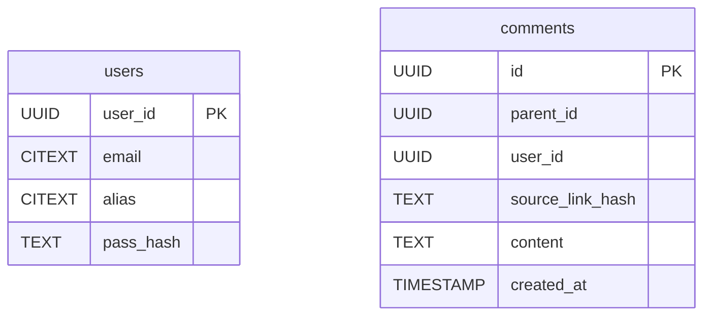
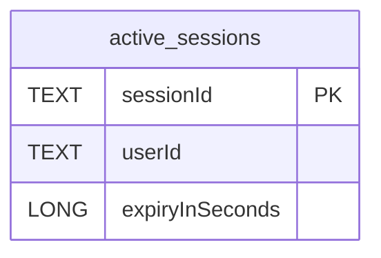
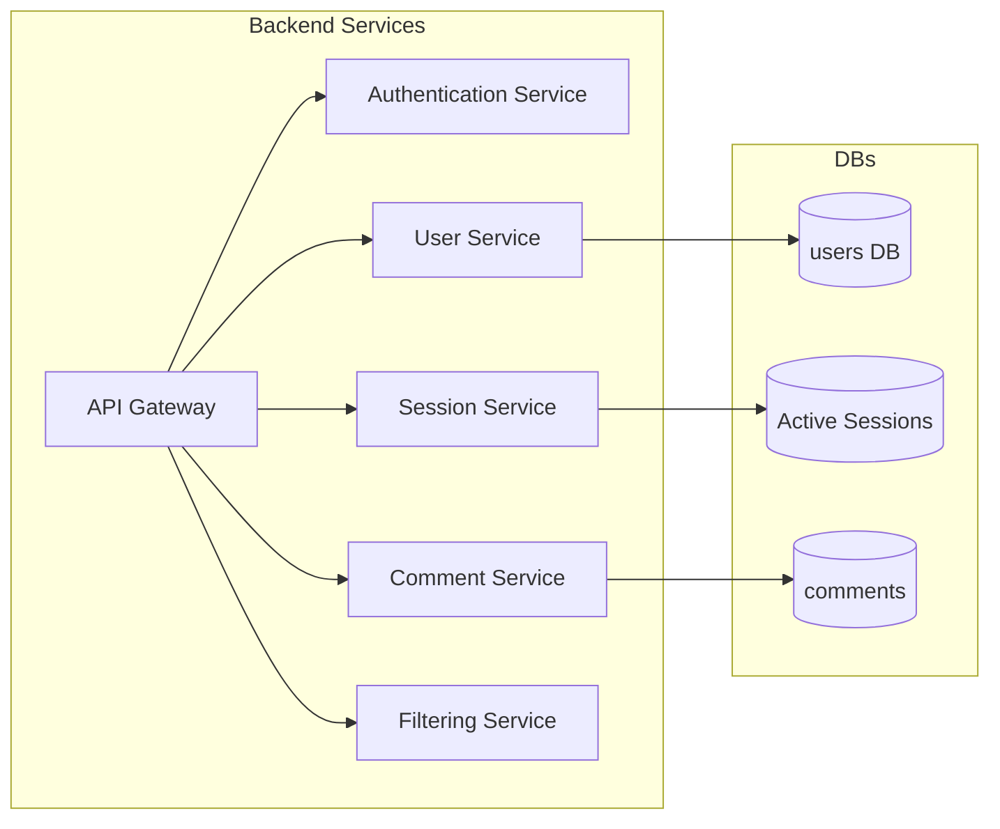
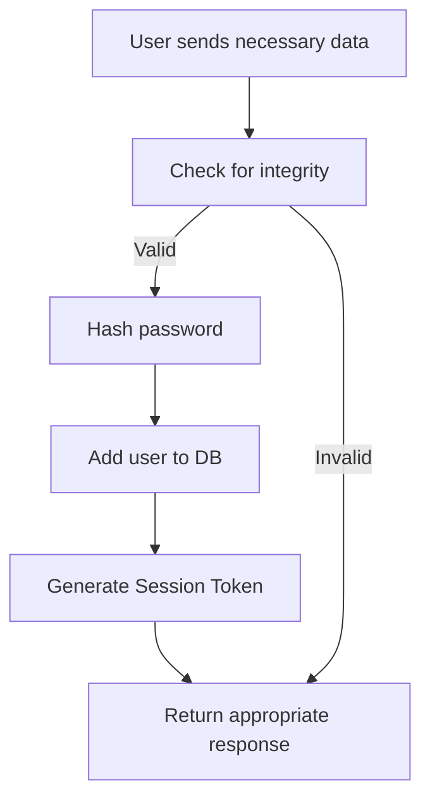
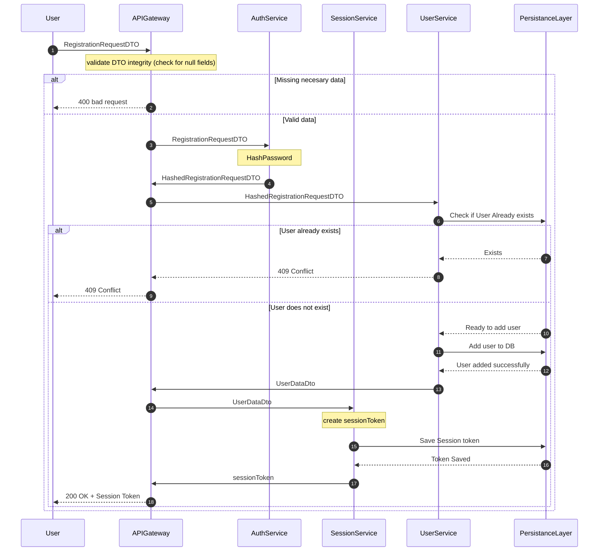

## Necessary DB data

**_PostgreSQL_**

**_Redis_**

## All the backend services in Coordinator->subordinate roles

## Sequence Diagrams for implementation

### Registration:

#### Abstract:

#### Implementation:

