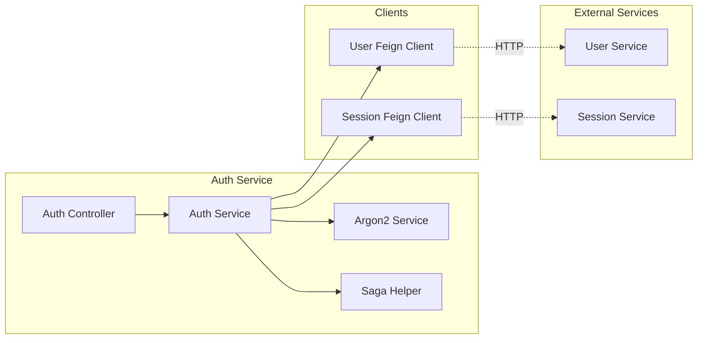
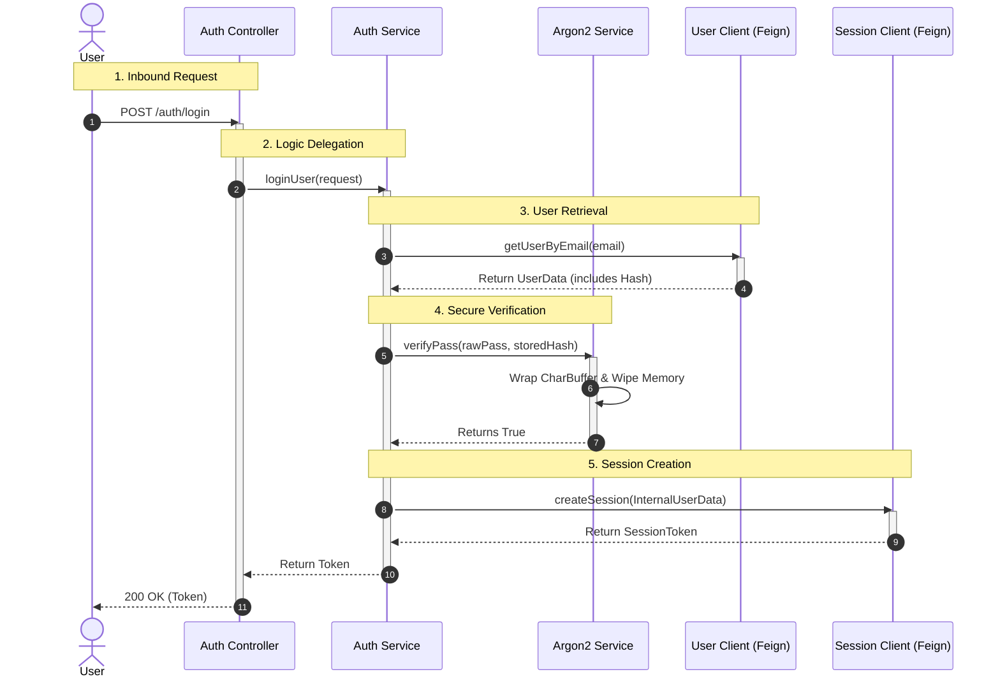
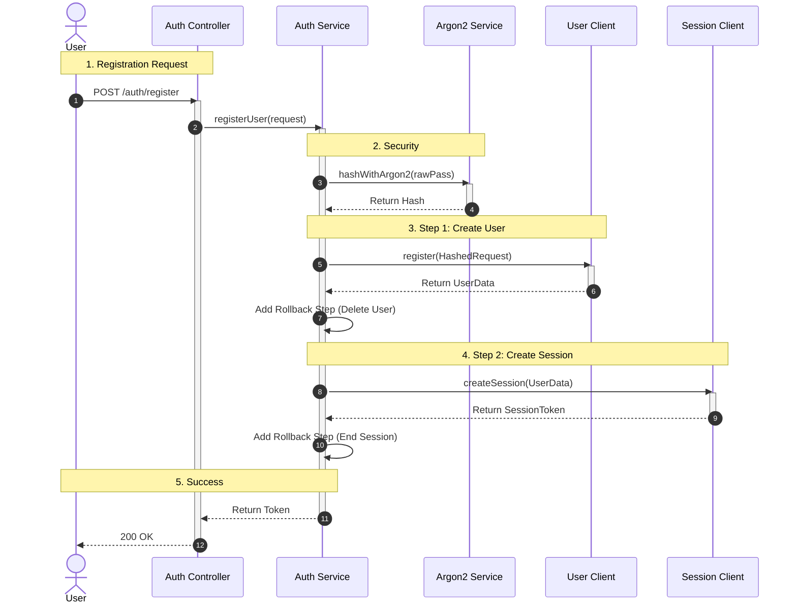
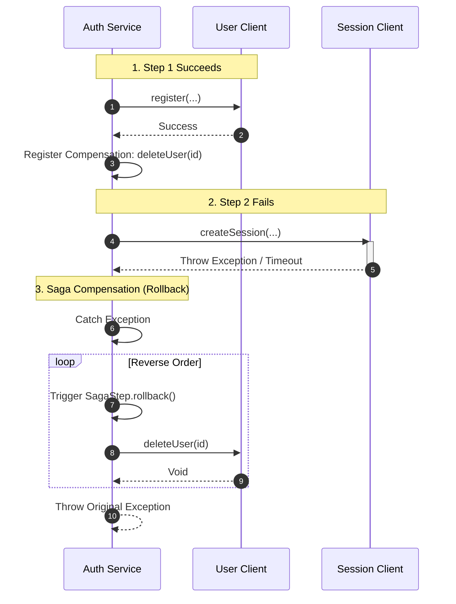

# Overview

This Service Orchestrates **UserService** for user specific persistence, and **SessionService** for session generation and persistence.

## Chapters

1. [Data FLow](#request-flow)
2. [Login](#login)
3. [Registration](#registration)
4. [Rollback](#registration)

## Data Flow

## Login:

## Registration

## Rollback

