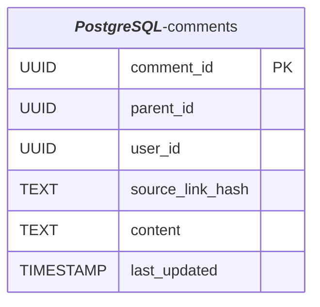
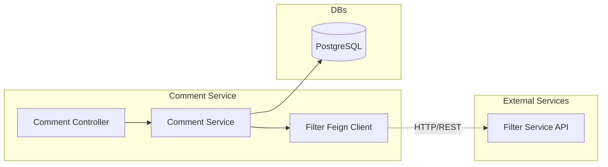
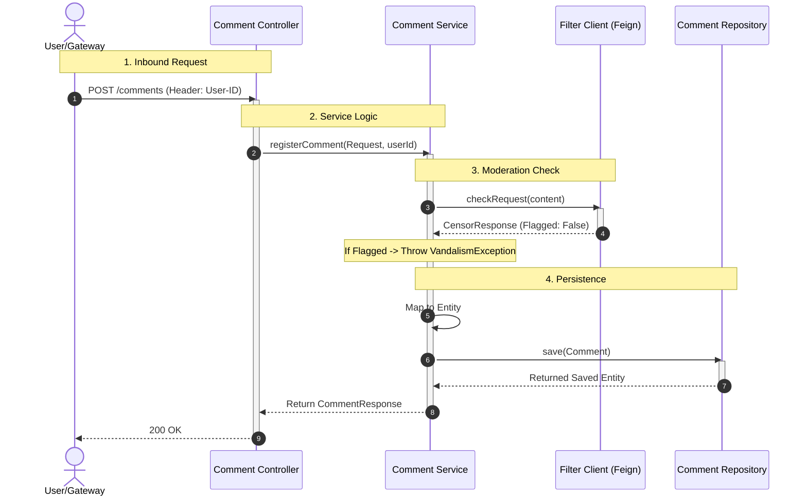
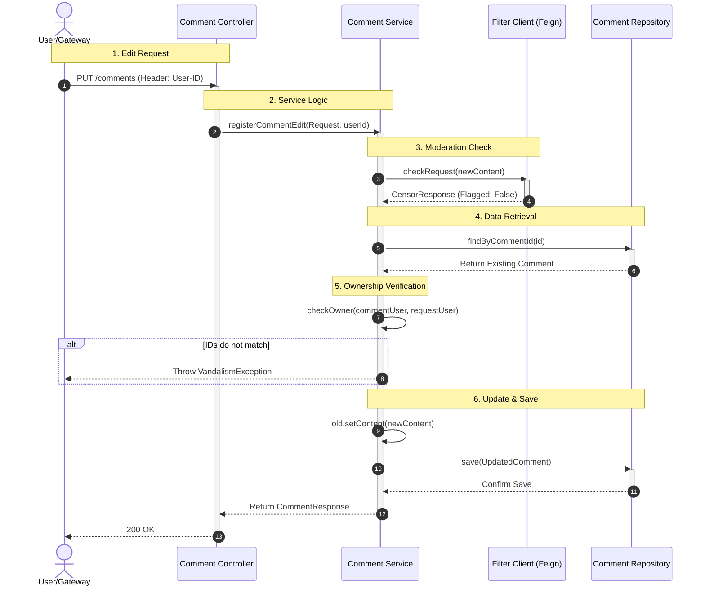
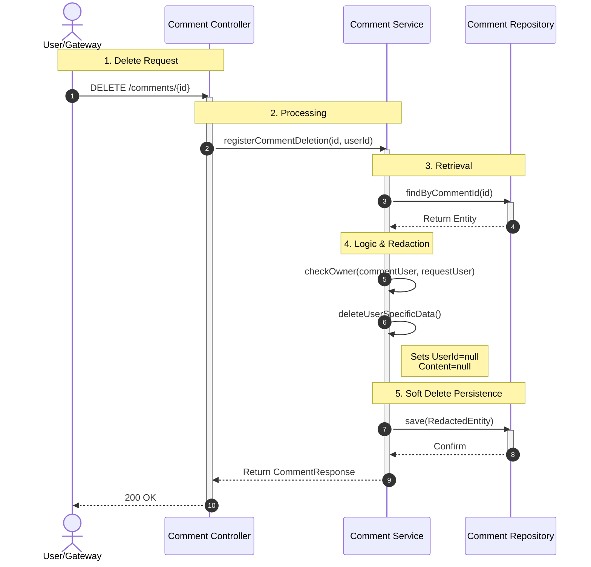

# Overview

This service handles comment persistence and orchestrates profanity filtration vie FilterService

## Chapters
1. [Necessary DB data](#necessary-db-data)
2. [Abstract data flow](#abstract-data-flow)
3. [Post Comment Logic Flow](#post-comment-logic-flow)
4. [Edit Comment FLow](#edit-comment-flow)
5. [Delete Comment Flow](#delete-comment-flow)
## Necessary DB data


## Abstract data flow:



## Post Comment Logic Flow



## Edit Comment FLow



## Delete Comment Flow



```mermaid

```

```mermaid

```
