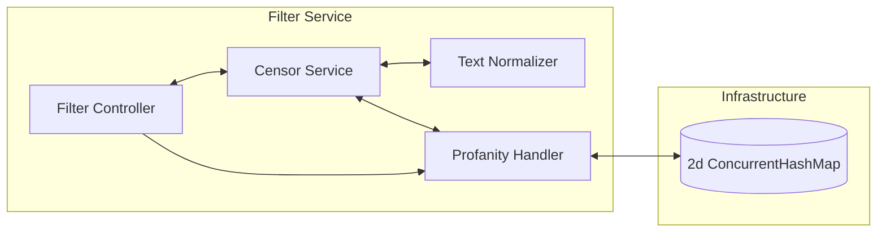
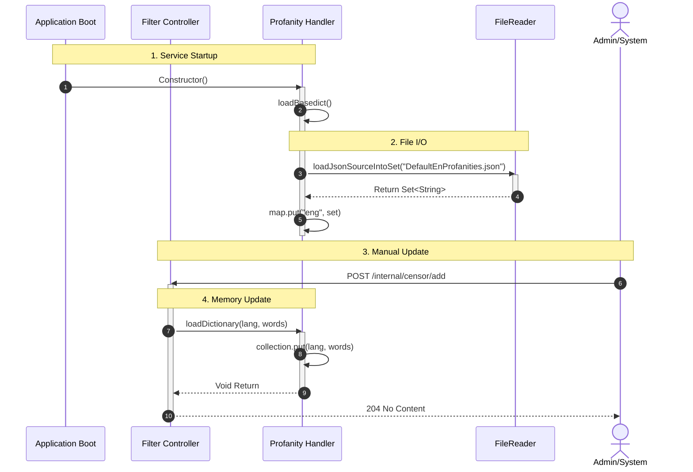
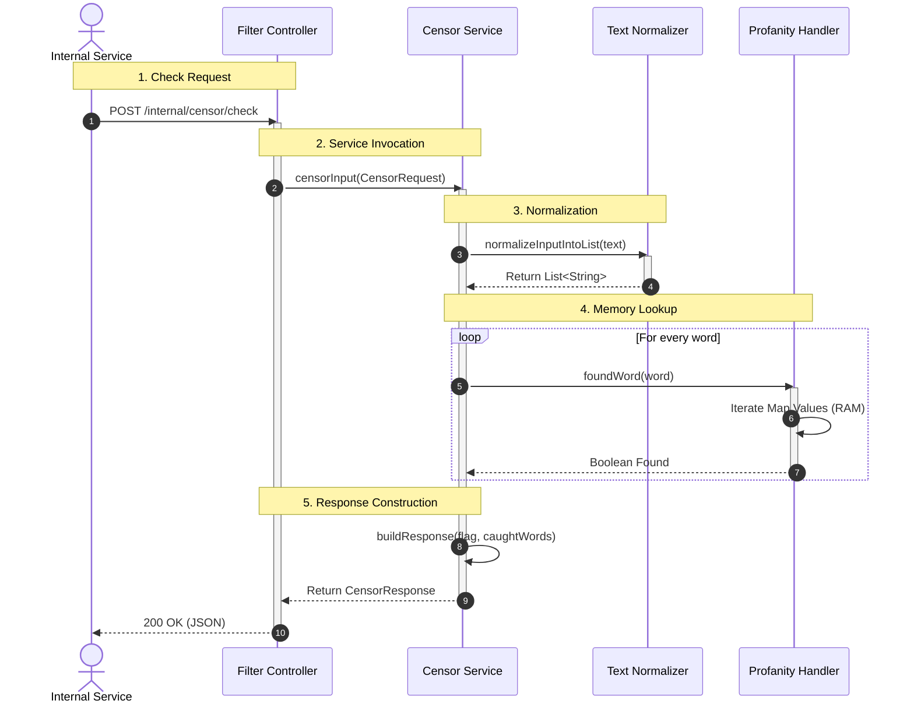
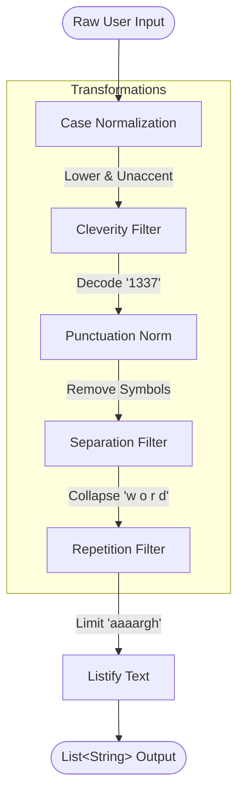
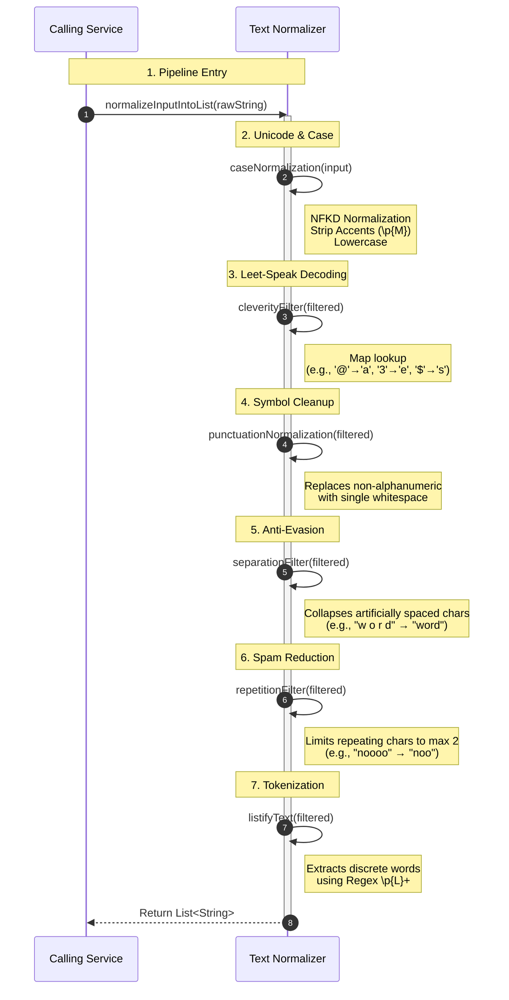

# Overview

This service Normalizes and filters input text.

## Chapters

1. [Data Flow](#dataflow)
2. [Dict Update Chain](#dict-update-chain)
3. [Filter Request Chain](#filter-request-chain)
4. [In Built Normalization chain](#in-built-normalization-chain)

## DataFlow

## Dict Update Chain

This service supports hot Loading new Data sets into the concurentHashMap, thus avoiding downtime.

## Filter Request Chain

**Logic chain for censorship requests**

## In Built Normalization chain

**Logic chain for normalizing text inputs** Feel free to tinker with it.

### Abstract:

### Detailed:

