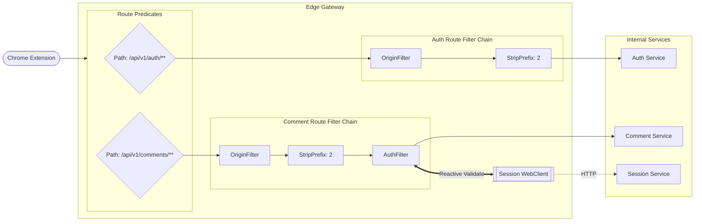
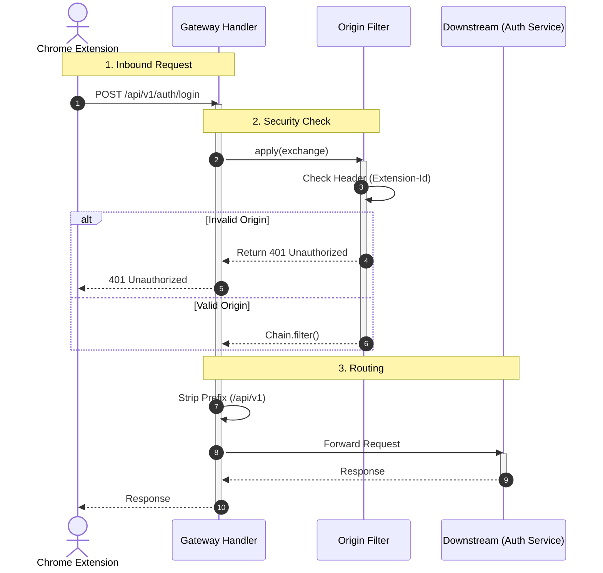
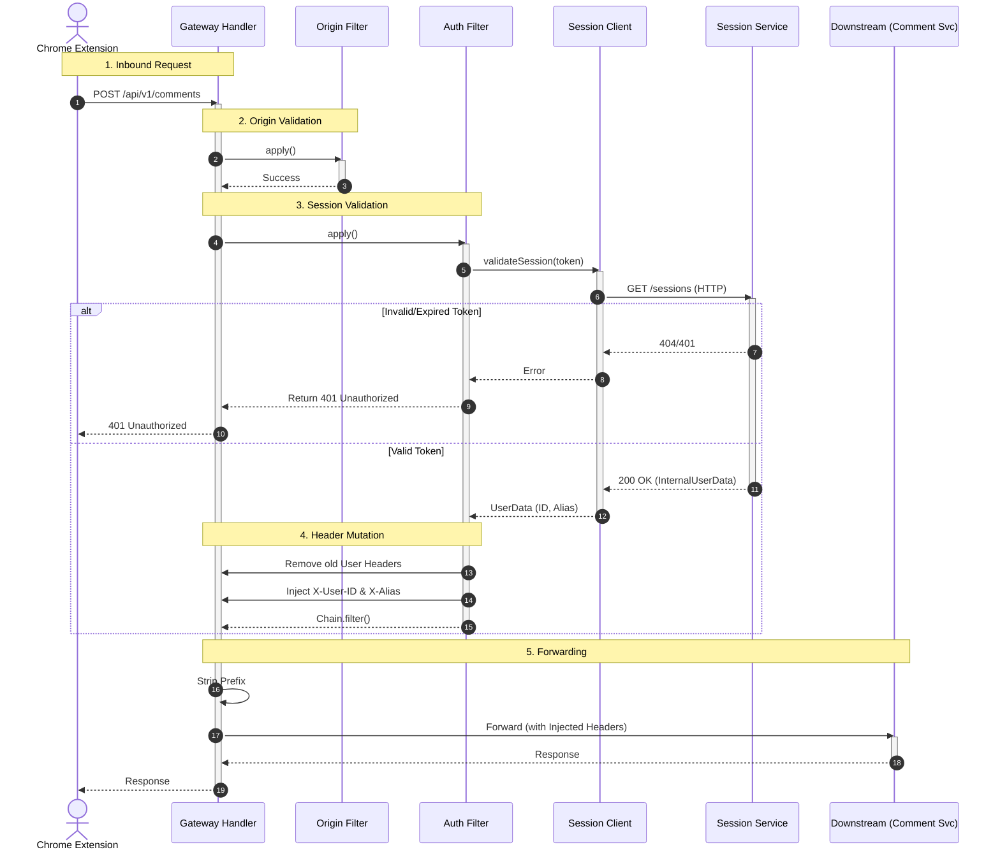

# Overview
Edge gateway, handles routing and session validation for certain protected paths.

## Chapters

## Abstract:

```mermaid
flowchart LR
    Client([Chrome Extension])

    subgraph Gateway [Edge Gateway]
        direction TB
        
        subgraph PathSelection [Route Predicates]
            AuthPath{Path: /api/v1/auth/**}
            CommentPath{Path: /api/v1/comments/**}
        end

        subgraph AuthFilters [Auth Route Filter Chain]
            F1_Origin[OriginFilter]
            F1_Strip[StripPrefix: 2]
        end

        subgraph CommentFilters [Comment Route Filter Chain]
            F2_Origin[OriginFilter]
            F2_Strip[StripPrefix: 2]
            F2_Auth[AuthFilter]
        end
        
        WebClient[[Session WebClient]]
    end

    subgraph Downstream [Internal Services]
        AuthSvc[Auth Service]
        CommentSvc[Comment Service]
        SessionSvc[Session Service]
    end

    %% Client Entry
    Client --> PathSelection

    %% Auth Service Path
    AuthPath --> F1_Origin
    F1_Origin --> F1_Strip
    F1_Strip --> AuthSvc

    %% Comment Service Path
    CommentPath --> F2_Origin
    F2_Origin --> F2_Strip
    F2_Strip --> F2_Auth
    
    %% Auth Filter Dependency
    F2_Auth <==>|Reactive Validate| WebClient
    WebClient -.->|HTTP| SessionSvc
    
    %% Final Forwarding
    F2_Auth --> CommentSvc


```

## Origin Filter:

```mermaid
sequenceDiagram
    autonumber
    actor Client as Chrome Extension
    participant GW as Gateway Handler
    participant Origin as Origin Filter
    participant Auth as Downstream (Auth Service)

    Note over Client, GW: 1. Inbound Request
    Client->>GW: POST /api/v1/auth/login
    activate GW

    Note over GW, Origin: 2. Security Check
    GW->>Origin: apply(exchange)
    activate Origin
    Origin->>Origin: Check Header (Extension-Id)
    
    alt Invalid Origin
        Origin-->>GW: Return 401 Unauthorized
        GW-->>Client: 401 Unauthorized
    else Valid Origin
        Origin-->>GW: Chain.filter()
        deactivate Origin
    end

    Note over GW, Auth: 3. Routing
    GW->>GW: Strip Prefix (/api/v1)
    GW->>Auth: Forward Request
    activate Auth
    Auth-->>GW: Response
    deactivate Auth

    GW-->>Client: Response
    deactivate GW
```

## Session Filter

```mermaid
sequenceDiagram
    autonumber
    actor Client as Chrome Extension
    participant GW as Gateway Handler
    participant Origin as Origin Filter
    participant AuthF as Auth Filter
    participant S_Client as Session Client
    participant Remote as Session Service
    participant Dest as Downstream (Comment Svc)

    Note over Client, GW: 1. Inbound Request
    Client->>GW: POST /api/v1/comments
    activate GW

    Note over GW, Origin: 2. Origin Validation
    GW->>Origin: apply()
    activate Origin
    Origin-->>GW: Success
    deactivate Origin

    Note over GW, AuthF: 3. Session Validation
    GW->>AuthF: apply()
    activate AuthF
    
    AuthF->>S_Client: validateSession(token)
    activate S_Client
    S_Client->>Remote: GET /sessions (HTTP)
    activate Remote
    
    alt Invalid/Expired Token
        Remote-->>S_Client: 404/401
        S_Client-->>AuthF: Error
        AuthF-->>GW: Return 401 Unauthorized
        GW-->>Client: 401 Unauthorized
    else Valid Token
        Remote-->>S_Client: 200 OK (InternalUserData)
        deactivate Remote
        S_Client-->>AuthF: UserData (ID, Alias)
        deactivate S_Client
        
        Note over AuthF, GW: 4. Header Mutation
        AuthF->>GW: Remove old User Headers
        AuthF->>GW: Inject X-User-ID & X-Alias
        AuthF-->>GW: Chain.filter()
        deactivate AuthF
    end

    Note over GW, Dest: 5. Forwarding
    GW->>GW: Strip Prefix
    GW->>Dest: Forward (with Injected Headers)
    activate Dest
    Dest-->>GW: Response
    deactivate Dest

    GW-->>Client: Response
    deactivate GW
    

```