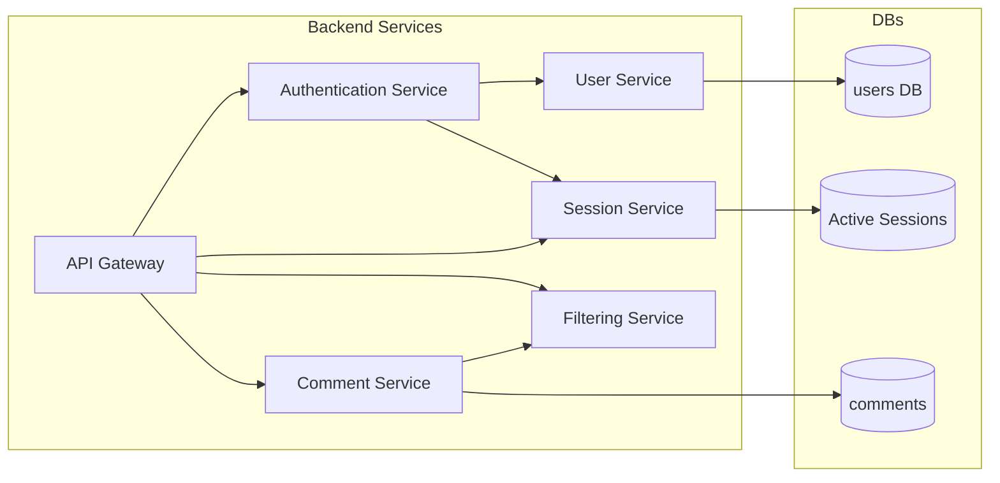

# VoxPopuli

This project aims to bring back the comment section to every website.

## Overview

I’m building this as a learning project to explore microservices through extensive service-to-service communication in a Docker stack. I’ve built the backend within the Spring Boot ecosystem. For authentication, I’ve opted for Spring Security; for data persistence, JPA, PostgreSQL; for opaque session tokens, Redis; and for communication both WebMvc and Webflux. I’ve opted for both for a couple of reasons. Feign clients werea easier to use in a Saga esque pattern where service-to-service communication is state-dependent. At the edge gateway however, I’ve chosen webflux for 2 reasons.

1. I've read that its non blocking thus for high throughput its better.
2. Nicer and Easier Syntax for custom header mutations compared to WebMvc.

### Why microservices?

Indeed, a modular monolith would have been much less of a hassle; I wouldn’t have had to worry about availability, service rollbacks, inter service failiures, inter service communication nor secure routing. It is the prudent choice for an app of this size. My aim, however, was to expose and familiarize myself with the specificities of this architecture.

With this approach, I’ve learned how to use Docker and Dockerfiles, how to debug interconnected services, how to perform inter-service rollbacks, communication and especially the importance of testing. Specifically with Testcontainers, thus avoiding concerns about the subtle differences between an H2 in-memory database and PostgreSQL/Redis.

## Tech Stack used

### Backend

**Language:** Java

**Framework:** Spring Boot

**Service to service communication:** Spring MVC, Spring Webflux

**Security:** Spring Security, Argon2, Opaque Tokens

**Testing:** Junit, Mockito, Testcontainers

**Persistance:** JPA, PostgreSQL, Redis

**Tools:** Maven, Git, Github Actions

### Frontend:

**Language:** TypeScript

**Chrome APIs:** .storage, .runtime

**UI:** React

**Persistence:** Tanstack

**Styling:** Tailwind

**Build Tools:** Vite

## Architecture

Edge gateway with Orchestrating Services underneath.
**Auth Service** controls and orchestrates everything user related (login/logout, name/password changes, and other basic CRUD).

**Comment Service** controls and orchestrates anything comment related (CRUD, filtering for words, etc.).

**Gateway** edge gateway validates opaque tokens (calls SessionService), validates request origins, cleans headers, and handles routing.

To avoid DTO hell, I've opted for contract based communication. for now this works on a shared Jar. Updating to openApi is on the list.

Service-to-service-level sequence diagrams can be found in the [Architecture.md](Architecture.md) file. Service implementation-level diagrams are found in the Architecture.md files within each service directory.

## Files and Folders:

**AuthenticationService/.** microservice for authentication. Orchestrates user persistence and session lifecycle.

**CommentService/.** microservice for comment specific CRUD. Orchestrates FilterService for moderation purposes.

**contracts/.** commonly used DTOs.

**FilterService/.** moderation microservice, handles text normalization, and moderation libraries.

**Gateway/.** Edge Gateway for routing.

**SessionService/.** microservice for session specific CRUD.

**UserService/.** microservice for user specific CRUD.

[**Architecture.md**](Architecture.md) sequence diagrams for communication flows.

**docker-compose-dev.yml** runs the services in development mode with hot reload support, allowing you to see code changes instantly.

**docker-compose.yml** proper containerization for the app, with proper builds and settings.

**Readme.md** description.

[**Project Journal.md**](ProjectJournal.md) Issues I've faced along the way

## Quick Start

1.  clone this repository
2.  navigate your IDE/ terminal to the contracts folder.
3.  run : `mvn clean install` (these are the commonly used DTO's, Working on a cleaner solution is in the list)
4.  navigate your IDE/ terminal to the root of this project.
5.  run : `docker compose -f docker-compose-dev.yml up`
6.  you can send requests to it via your preferred platform (Postman Curl)
7.  DTO's for structuring requests can be found in the **contracts** folder

## TODO:

**Backend:**

- [x] User Service.
- [x] Comment Service.
- [x] Authentication Service.
- [x] Filter Service.
- [x] Gateway Service.

**Frontend:**

- [x] Authentication logic.
- [x] Messaging logic (extension ↔ backend).
- [x] BackgroundScript.
- [x] Popup UI.
- [x] Comment Logic for the Shadow Dom and content scripts.

**Integration:**

- [ ] Deploy Microservices to a Host
- [ ] Publish Extension.
