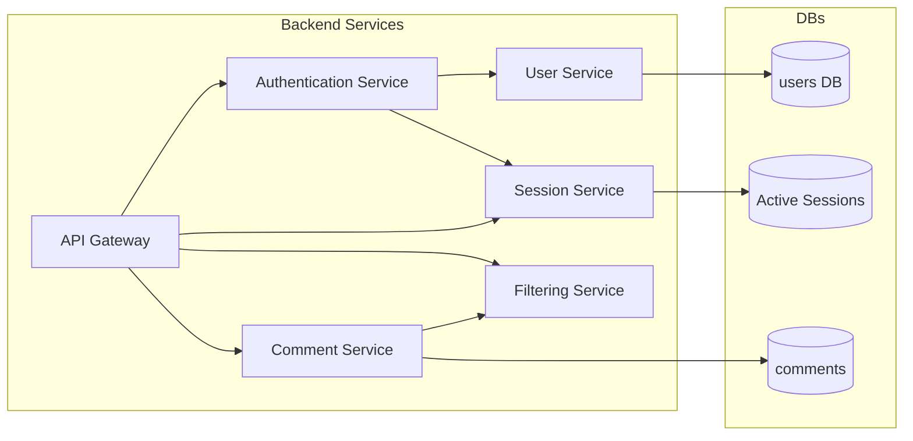

# VoxPopuli

This project aims to bring back the comment section to every website.

## Overview

I’m building this as a learning project to explore microservices through extensive service-to-service communication in a Docker stack. I’ve built the backend leveraging the Spring Boot ecosystem. For authentication, I’ve opted for Spring Security; for data persistence, JPA and PostgreSQL; and for opaque session tokens, Redis. To facilitate communication, I’ve chosen both blocking and non-blocking communication methods. Feign clients are used in a Saga pattern where service-to-service communication is state-dependent. At the edge gateway, I’ve opted for WebFlux for concurrency reasons.

### Why microservices?

Indeed, a modular monolith would have been much less of a hassle; I wouldn’t have had to worry about availability, service rollbacks on inter service failiures, inter service communication nor secure routing. It is the prudent choice for an app of this size. My aim, however, was to expose and familiarize myself with the quirks of this architecture.

With this, I’ve learned how to use Docker and Dockerfiles, how to debug interconnected services, and how to perform inter-service rollbacks. I also learned the importance of testing, especially with Testcontainers, thus avoiding concerns about the subtle differences between an H2 in-memory database and PostgreSQL/Redis.

## Tech Stack used

**Backend:** Spring Boot, Java, JPA 

**Frontend:**  React, TypeScript, chrome API (storage, runtime), Vite, Tailwind

**Communication:** Spring MVC (FeignClient), Spring Webflux (WebClient)

**Testing:** Junit, Mockito, Testcontainers

**Security:** Spring Security, Argon2, Opaque Tokens

**Database:** PostgreSQL, Redis

**Tools:** Maven, Git

## Architecture

Edge gateway with Orchestrating Services underneath.
**Auth Service** controls and orchestrates everything user related (login/logout, name/password changes, and other basic CRUD).

**Comment Service** controls and orchestrates anything comment related (CRUD, filtering for words, etc.).

**Gateway** edge gateway validates opaque tokens (calls SessionService), validates request origins, cleans headers, and handles routing.

To avoid DTO hell, I've opted for contract based communication. for now this works on a shared Jar. Updating to openApi is on the list.

Service-to-service-level sequence diagrams can be found in the [Architecture.md](Architecture.md) file. Service implementation-level diagrams are found in the Architecture.md files within each service directory.

## Files and Folders:

**AuthenticationService/.** microservice for authentication. Orchestrates user persistence and session lifecycle.

**CommentService/.** microservice for comment specific CRUD. Orchestrates FilterService for moderation purposes.

**contracts/.** commonly used DTOs.

**FilterService/.** moderation microservice, handles text normalization, and moderation libraries.

**Gateway/.** Edge Gateway for routing.

**SessionService/.** microservice for session specific CRUD.

**UserService/.** microservice for user specific CRUD.

[**Architecture.md**](Architecture.md) sequence diagrams for communication flows.

**docker-compose-dev.yml** runs the services in development mode with hot reload support, allowing you to see code changes instantly.

**docker-compose.yml** proper containerization for the app, with proper builds and settings.

**Readme.md** description.

[**Project Journal.md**](ProjectJournal.md) Issues I've faced along the way

## Quick Start
 1. clone this repository
 2. navigate your IDE/ terminal to the root of this project.
 3. run : `docker compose -f docker-compose-dev.yml up`
 4. you can send requests to it via your preferred platform (Postman Curl)
 5. DTO's for structuring requests can be found in the **contracts** folder

 ## TODO:

**Backend:**

- [x] User Service.
- [x] Comment Service.
- [x] Authentication Service.
- [x] Filter Service.
- [x] Gateway Service.

**Frontend:**

- [x] Authentication logic.
- [x] Messaging logic (extension ↔ backend).
- [ ] BackgroundScript.
- [ ] Shadow DOM logic.
- [ ] Popup UI.

**Integration:**

- [ ] Deploy Microservices to a Host
- [ ] Publish Extension.
