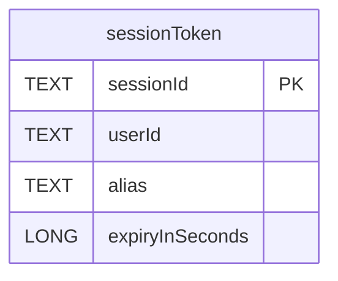
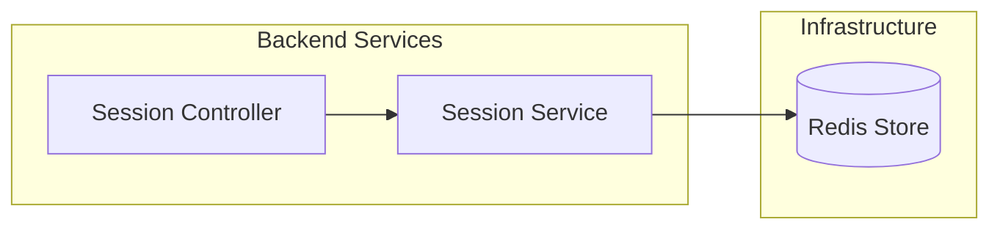
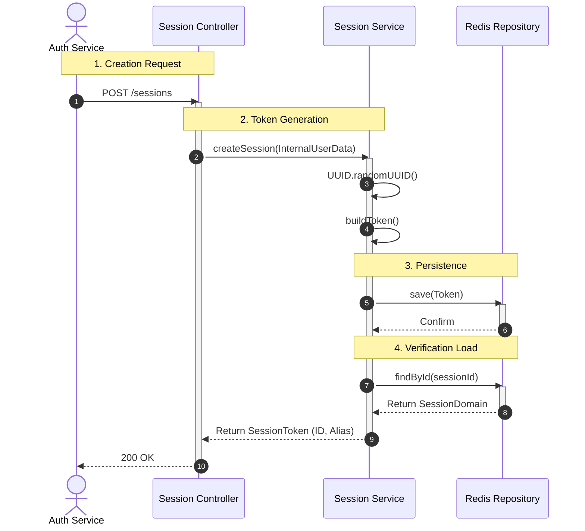
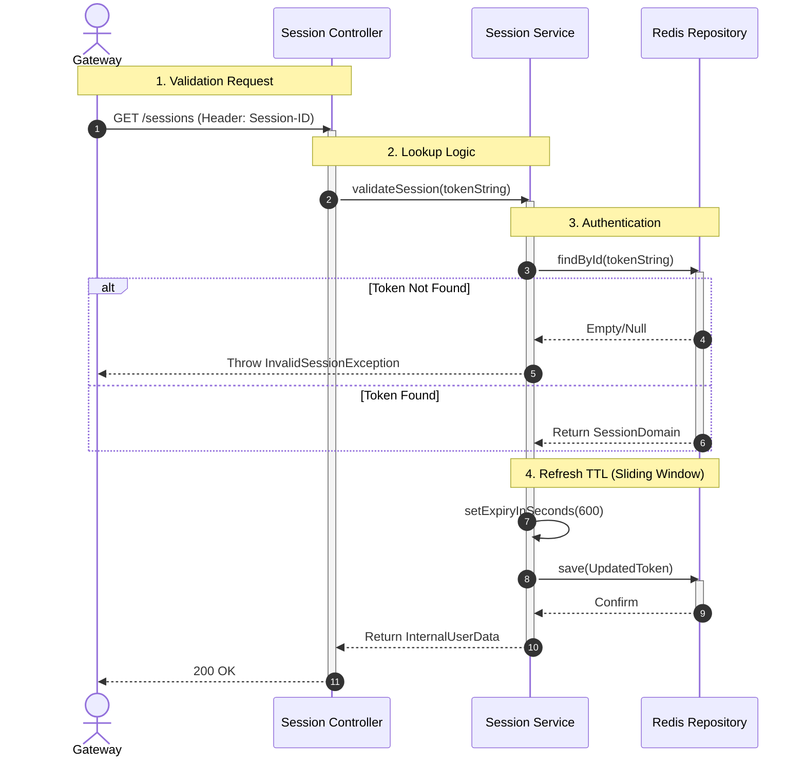
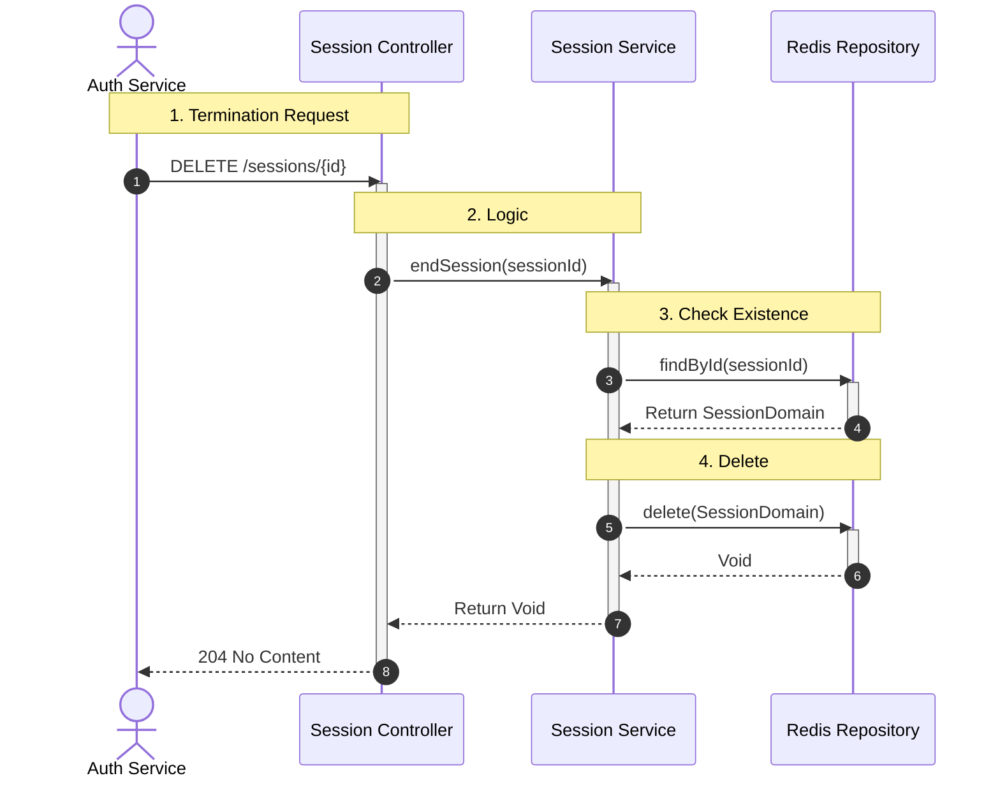

# Overview

This service handles session generation persistrence and validation.

## Chapters:

1. [Redis](#redis)
2. [Data Flow](#data-flow)
3. [Create Session](#create-session)
4. [Validate Session](#validate-session)
5. [End Session](#end-session)

## Redis

## Data Flow

## Create Session:

## Validate Session:

## End Session:

