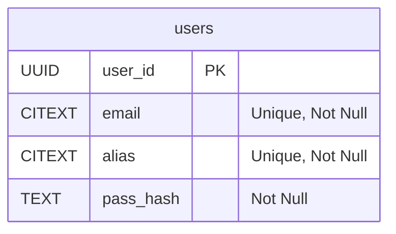
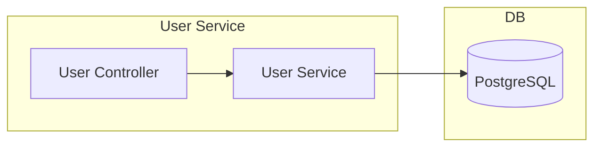
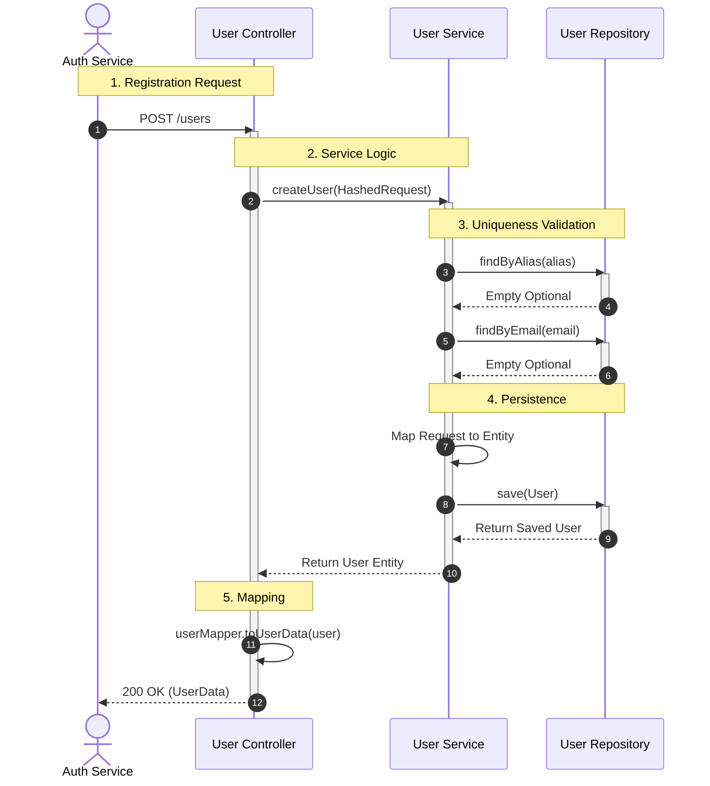
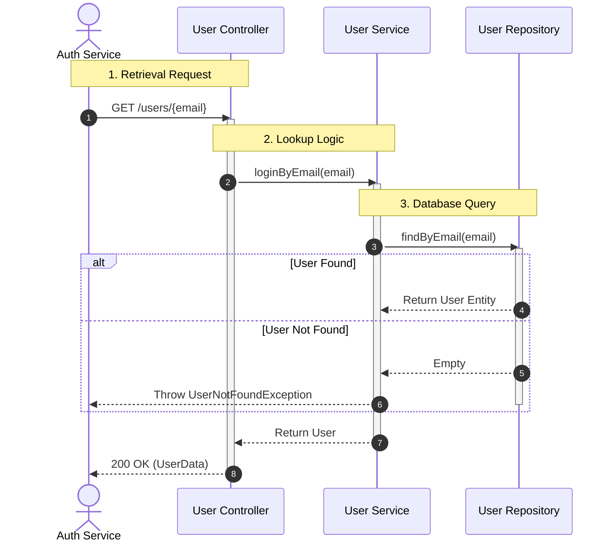
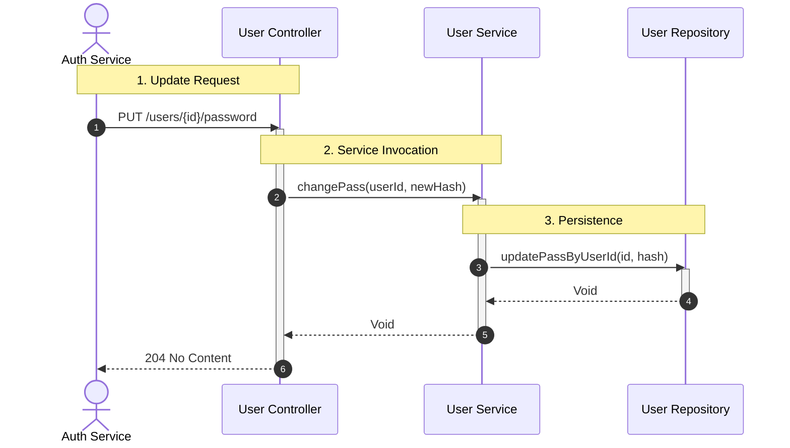

# Overview
This service handles user specific persistence
## Chapters
1. [DB structure](#db-structure)
2. [Data Flow](#data-flow)
3. [Create User](#create-user)
4. [Retrieve User](#retrieve-user)
5. [Update password](#update-password)
## DB Structure

## Data Flow

## Create User

## Retrieve User

## Update password 

